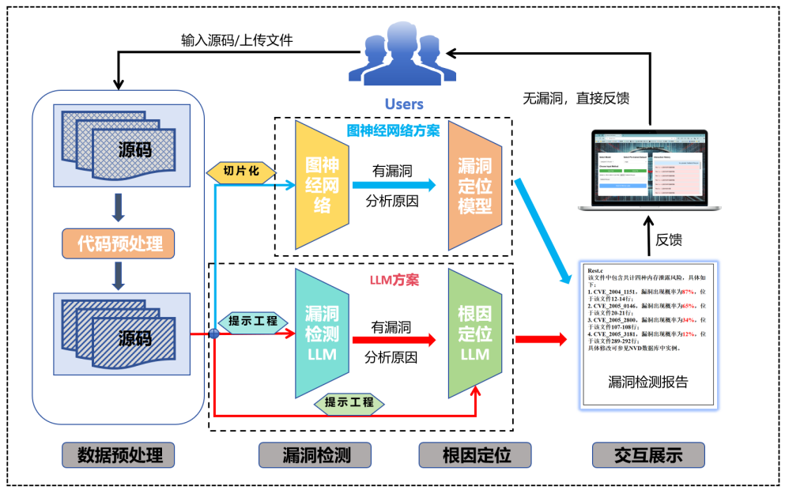
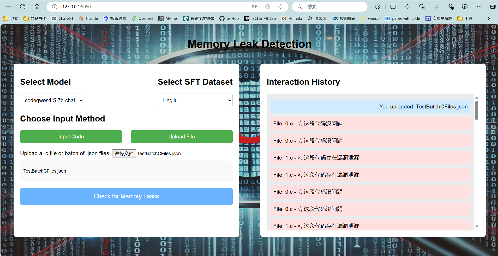

# lingjiu_VD-RCA
Vulnerability Detection and Root Cause Analysis(VD-RCA) of C/C++ programs, implementing two different schemes based on GNNs and LLMs.

## Abstract
 As software complexity rises, research on vulnerability detection becomes increasingly important. Deep learningbased vulnerability detection, an emerging approach, can segment code and identify hidden vulnerability patterns. However, challenges remain: difficultly correlating code slices with scripts to minimize false positives and the low precision of root cause localization (identify the number of lines where the vulnerability is located) for vulnerable scripts. To alleviate these, this paper introduces a vulnerability detection and root cause localization approach leveraging large language model (LLM). The approach extracts graph structures from c/c++ codes and combines them with the script to form prompts. A novel parameter-efficient language model tuning (PELT) approach fine-tunes the LLM for the two tasks. Experimental results on three datasets demonstrated improvements: in vulnerability detection, our approach boosted average accuracy (ACC) by 4.11% and macro-F1 (M-F1) by 3.67% over the state-of-the-art (SOTA); in root cause localization, it could more accurately locate vulnerabilities. 
 

## Results
The Final Results of the Testset(TestCode, C/C++ scripts) provided by the CSC-709:


## LLMs Rundown
#### Total Pipeline
1. Please preprocess the dataset, including deleting comments, removing blank lines, etc., and organize the scripts into Json-List (with Dict elements) files according to the training set and the test set, respectively. Don't forget to register the dataset in the `data/dataset_info.json` file.
``` cmd
python normalization.py 
cd ./data
python maketestjson.py
```
2. Download the pre-trained language models (e.g., Qwen2-7B, codeqwen1.5-7B, etc.).
``` cmd
cd root_dirs
python download.py
```
3. Modify the parameters in the configuration file(*.yaml), including the location of the pre-trained model, the location of the LoRA parameter storage, the dataset, the result output address, etc.
4. Finetuning the pre-trained language models for the two tasks(vulnerability detection and root cause localization).
- vulnerability detection
``` cmd
train：
CUDA_VISIBLE_DEVICES=0 llamafactory-cli train examples/train_lora/detect_lora_sft.yaml
test：
CUDA_VISIBLE_DEVICES=0 llamafactory-cli train examples/train_lora/detect_lora_predict.yaml
``` 
- root cause localization
``` cmd
train：
CUDA_VISIBLE_DEVICES=0 llamafactory-cli train examples/train_lora/root_lora_sft.yaml
test：
CUDA_VISIBLE_DEVICES=0 llamafactory-cli train examples/train_lora/root_lora_predict.yaml
``` 
5. Human-Computer Interaction(HCI) for the user to evaluate the results and select the best model.
    Please pre-train the model and save the parameters, choose to paste the source code or upload the file for testing.
``` cmd
cd ./MyGUI
python app.py
``` 

## GNNs Rundown
Please configure your environment first and install the appropriate version of jdk-17, Joern, torch-geometric and other necessary software dependencies. Please follow
the instructions in the README.md file in the `SLices/preprocess/Readme.md` directory to set up the environment and run the experiments.

## Email
Any furthur questions or concerns, please feel free to contact me at <hustmx721@gmail.com>